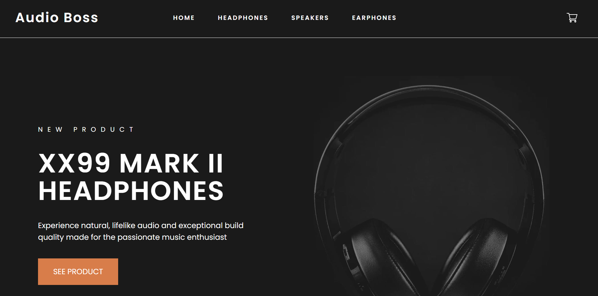
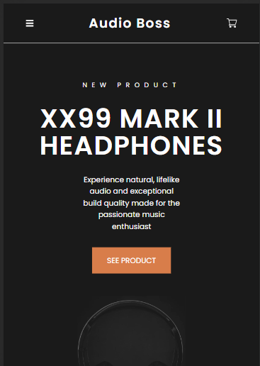
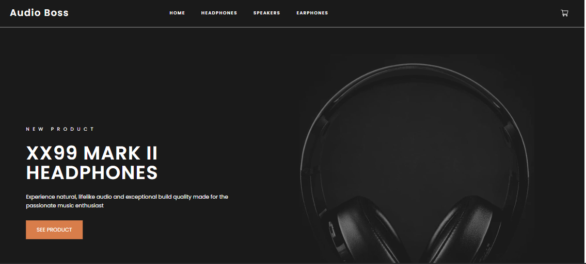

## 🤗🤗 Happing Coding 🤗🤗

### 🌐 React Audio Boss E-commerce App 🌐

### Description

- This is a simple react e-commerce app for the audio related developed using any tailwind,framer-motion animation library.This is a sample static app only with the front end and UI. This app is responsive as well.

## Sample Images

## PC

- 

## Mobile

- 

## Desktop

- 

## Tablet

- 

### Demo URL

- https://vardhan-venkata.github.io/react-audio-boss/

### Packages used

- react -> For react app we need this package.
- react-dom -> To handle DOM related we need this package.
- react-scripts -> For Running scripts.
- framer-motion -> For the animation related library.
- react-router-dom -> For the react router and dom handling.
- styled-components -> For styling the components

### Usage

- Clone the repository
- Do npm install to install all the dependencies
- Run the project using npm run start

### How can I appreciate this repo? 💙

- By giving this repo a 🌟
